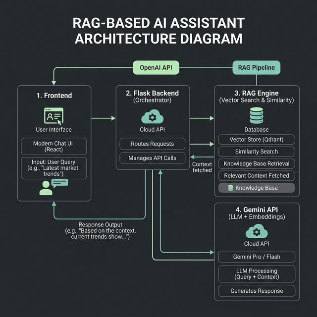

# Knowledge Base Assistant

This is a professional support assistant that uses Retrieval-Augmented Generation (RAG) to answer questions based on a specific set of documents. Unlike generic chatbots, this system is designed to be grounded—it references local data to provide accurate, reliable responses.

---

##  System Architecture

The application is built with a **Flask backend** and a high-performance **glassmorphic frontend**. When a user submits a query, the backend coordinates with a local RAG engine to pull relevant context before generating a refined response.

---

##  How it Works (The "Open-Book" Approach)

Think of this system as an **Open-Book Exam**. While most bots rely only on what they were "taught" during training, this assistant has access to a live **textbook** (`docs.json`).

1.  **Index Creation**: At startup, the system reads the documents and creates a searchable vector index.
2.  **Smart Retrieval**: When a question is asked, the engine scans the index for the most relevant sections.
3.  **Context Injection**: The question is combined with these retrieved sections.
4.  **Refined Answer**: The assistant processes this specific context to give a grounded, honest answer.

---

##  Technical Implementation

### Embedding Strategy: Giving Words an "Address"
Computers can't read text, so we convert every paragraph into a list of numbers called an **Embedding**. 

Think of every piece of info as a house in a massive city. An embedding is like a GPS coordinate for that house. 
- Houses about "Login" are built in the same neighborhood.
- Houses about "Shipping" are in a completely different part of town.

We use the **Gemini Embedding API** to place documents on this map. If two paragraphs are about similar topics (like "Login" and "Passwords"), they'll end up in the same neighborhood, making them easy to find even if they use different words.

### Similarity Search: The Ultra-Fast Librarian
When you ask a question, we turn that question into a coordinate too. We then use **Cosine Similarity** to calculate the distance between your question's coordinate and every paragraph in our library.
- The system pulls the **top 3** closest matches for every query.
- A **0.45 threshold** is applied to ensure quality. If a question is too far outside the scope of our data, the assistant will admit it doesn't know the answer rather than guessing.

### Grounding & Prompting (The Brief)
To maintain reliability, we don't just send your question to the AI. We send a carefully structured "brief" that includes:
1.  **Verified Context**: The exact paragraphs from our documents.
2.  **Conversation History**: What you were just talking about.
3.  **The Rule**: Use only the provided context. If it’s not there, say you don’t know.

This "Grounding" is what makes the assistant reliable for professional support environments, preventing it from making up false information.

---

##  Getting Started

1.  **Install Dependencies**:
    `pip install flask google-generativeai python-dotenv numpy`

2.  **Configure API Key**:
    Insert your `GEMINI_API_KEY` into the `.env` file.

3.  **Launch**:
    Run `python app.py` from your terminal.

4.  **Open App**:
    Navigate to `http://127.0.0.1:5000` in your browser.

---

*You can update the knowledge base at any time by modifying `docs.json`. The engine will automatically re-index the data on the next launch.*
